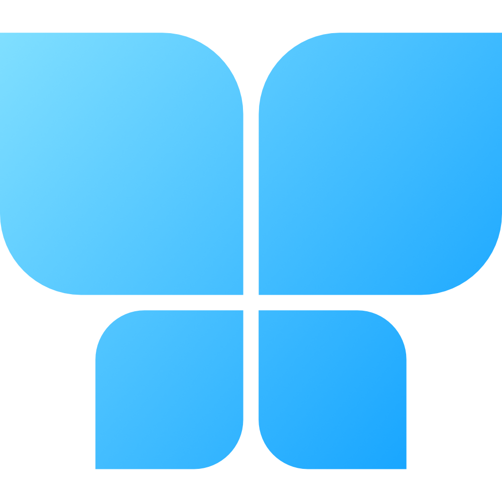

  

<h1 align="center">
  Beeskie
</h1>

  A Windows app for Bluesky

  

## Introduction

Beeskie is a free and open source third-party app for Bluesky. Big kudos to the team that built the Bluesky APIs, which Beeskie relies on heavily. The APIs are extremely thorough and they're very friendly to third-party apps. 

## Current status: Beta

The app is currently in private beta. You can write new posts, reply, repost, and like. You can view some notifications and you can see some embedded images. While it's still in very early days, app development is moving very fast and new features are added on a daily basis. 

## How can I help?

Join the beta by following [Beeskie on Bluesky](https://bsky.app/profile/beeskieapp.bsky.social) and telling me you want to join!

Once you're in, try out the app and send feedback! While I know there are many things missing still, it will be valuable if you tell me 3 things that you absolutely need ASAP in order to use the app on a more consistent basis. This will help me prioritize the features.

Create an issue and send your 3 top requests there.