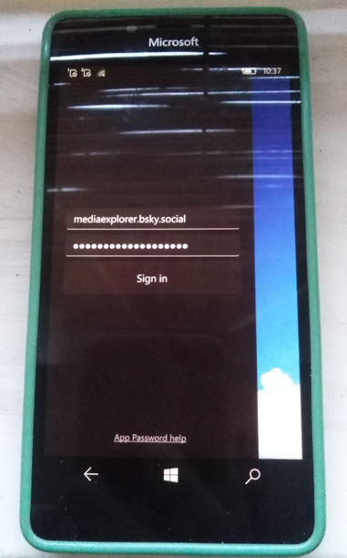
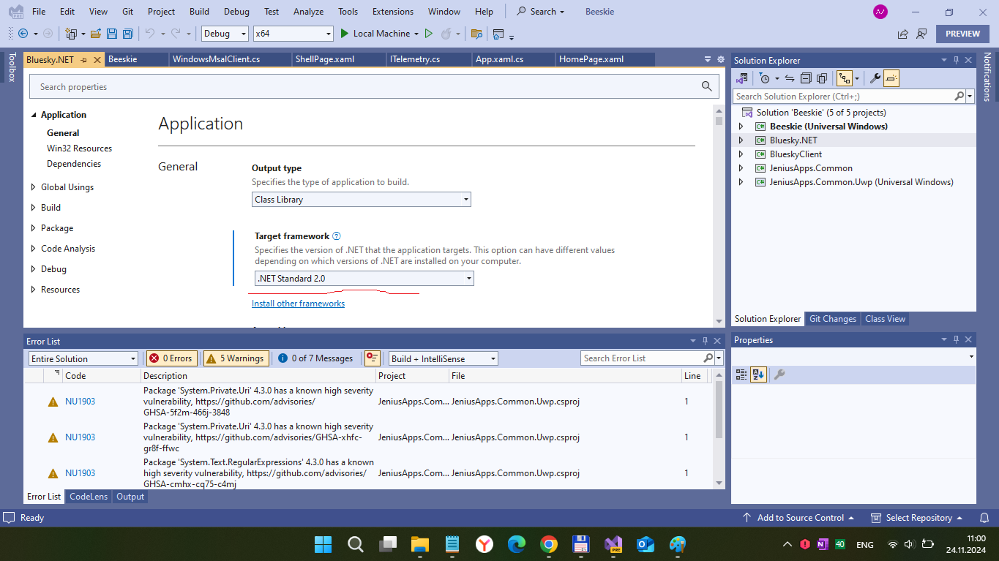
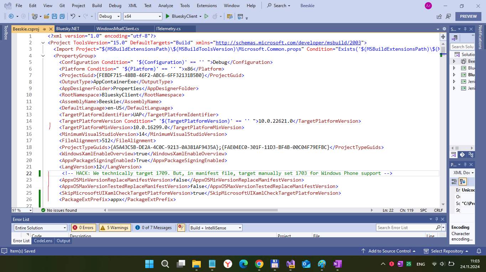
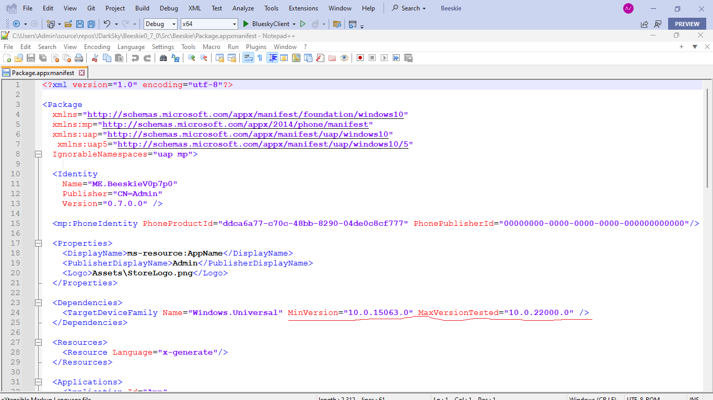

# Beeskie v0.7.0 (experimental) - fluent branch

My RnD of Beeskie, modern uwp app for BlueSky social network.  The main gool is to do Beeskie's src code W10M-compatible via very non-trivial "special mechanics".
 
## Intro ("Preface of research")

A few days ago I found [Beeskie project](https://github.com/jenius-apps/beeskie/). It is a free and open source third-party app for Bluesky. 
The app is currently in public beta. However, you can (may) download Beeskie (Beta) on [Microsoft Store](https://apps.microsoft.com/store/detail/9PCGNR7QHQGP?cid=github) just at now. The Beeskie's author Daniel from Jenius Apps, great developer of many cool apps such as Ambie Sounds. All is really cool, but I detected one great problem: all Daniel's projects are good only for x86/x64 "PC architecture". No ARM (mobile) compatibility. I decided to research & fix this deal a liitle :) So, my goal is to "partially adapt" Beeskie's code to sweet old lost broken cancelled Windows 10 Mobile OS. I focused only on "max. versions" of W10M - builds 15063 and above.

## Research
I quickly researched Beeskie's solution structure. It consists of 3 .net-standard 2.0-based "modules" (projects) and 2 uwp-based ones (min. win os build = 17xxx or even 18xxx). I changed 17xxx to 16299, and symplified code a little to support 16299. Ok, what else? Yesterday I accidentally came across an anomaly in the code of the Beeskie analogue called Uni Sky.  I suddenly discovered that a developer with the nickname [WamWooWam](https://github.com/WamWooWam) uses some secret mechanics to launch projects compiled for 16299 and net 2.0 on winphones! I couldn't believe my eyes and created an [issue](https://github.com/UnicordDev/UniSky/issues/7). The man replied to me (for which I thank him very much!) that I need to read this [gist](https://gist.github.com/WamWooWam/e72e5137606f7c59ed657db6587cd5e8). I researched this random find, and so I decided to try to apply this secret knowledge to the Beeskie project. Result: yea, it works/ operates!!! Mama mia :)  

## Screenshots

## Tech/dev details
- Platforms: UWP only
- Targets: x86; x64; ARM (and ARM64 potentially)
- OSes: Windows 10 (Mobile)
- Win. SDK used: 22621 
- Min. Win. OS build: tecnically 16299 / really 15063 !  

## Status / my 2 cents
- Cloning original source code, (re)searching xaml "15063-compatibility"
- Min. win sdk downshifted to 17134 !
- Draft. Prototype / Pre-Pre-Pre-Alpha version. Still exploring modern-ui & mvvm "magic"...
- Some common tools experiments / patches
- I fixing app crash(ing) after start.
- I detected that ShellPage & control "15063-compatibility" mismatch still there (app crashes after login)
 

## Caution
- I noticed that src code uses some "dev telemetry". It's question of your "login-password" security, I think. I have no time to fix cut off that deal. 
- Please use special "app password" for your own app tests. 

## ToDo
- Use some telemetry to "emulate" app debug

## References
- https://github.com/jenius-apps/beeskie/ Original Beeskie project
- https://github.com/jenius-apps/ Jenius Apps, Beeskie's creators/dev team 
- https://github.com/UnicordDev/UniSky/ UniSky, W10M-compatible BlueSky client by Thomas May aka WamWooWam   

## Licensing
MIT License

## ..
AS IS. No support. RnD only / DIY

## .
[m][e] November 2024

