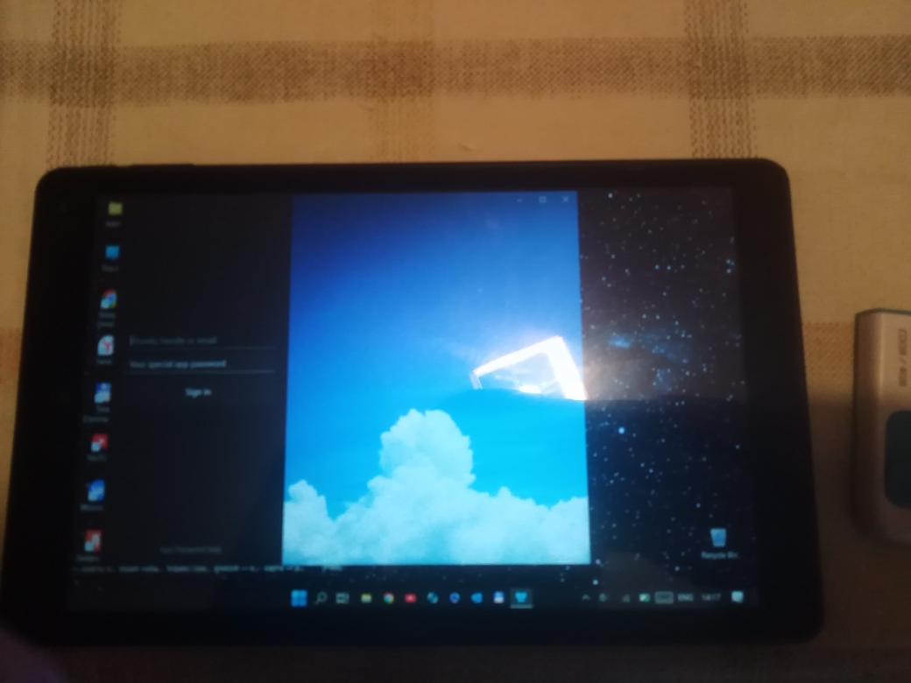

# Beeskie v0.7.0 (Beta) - andromeda branch

My RnD of Beeskie, modern uwp app for BlueSky social network.  The main gool is to do src code Andromeda-compatible (see https://github.com/mediaexplorer74/Andromeda  for details / my samples/dev kit)!
 
## About (words of the author)
"

*Introduction*

Beeskie is a free and open source third-party app for Bluesky. Big kudos to the team that built the Bluesky APIs, which Beeskie relies on heavily. The APIs are extremely thorough and they're very friendly to third-party apps. 

*Current status: Beta*

The app is currently in public beta. You can write new posts, reply, repost, and like. You can view some notifications and you can see some embedded images. While it's still in very early days, app development is moving very fast and new features are added on a daily basis. 

*How can I help?*

Download the app from the store by clicking the badge above, follow [Beeskie on Bluesky](https://bsky.app/profile/beeskieapp.bsky.social), and send feedback to that handle! While I know there are many things missing still, it will be valuable if you tell me 3 things that you absolutely need ASAP in order to use the app on a more consistent basis. This will help me prioritize the features. Of course, you can let me know of other issues such as bugs. Lastly, you can also create an issue in this repo to submit any feedback. Thanks for your help!

Beeskie (Beta) on Microsoft Store: https://apps.microsoft.com/store/detail/9PCGNR7QHQGP?cid=github
"
 - Daniel from Jenius Apps

## Screenshots

## Tech/dev details
- Platforms: UWP only
- Targets: x64; x64; ARM
- OSes: Windows 11 (however, W10M Andromeda is good mobile case too)))
- Win. SDK used: 22621 
- Min. Win. OS build: 17134 (Hello, Microsoft WCOS!) 

## Status / my 2 cents
- Micro-research + fork(ing) of original source code
- Min. win sdk downshifted to 17134 !
- Draft. Prototype / Pre-Pre-Pre-Alpha version. Still exploring modern-ui & mvvm "magic"...
- Some common tools experiments / patches
- I injected all fresh c# code & xaml fixes of original version 0.6.8 into my fork. 

## Caution
- I noticed that src code uses some "dev telemetry". It's question of your "login-password" security, I think. I have no time to fix cut off that deal. 
- Please use special "app password" for your own app tests. 

## TODO
- Return my Lumia 950 to "W10M build 17686" and take some photos of "Beeskie on Andromeda"... ;) 

## References
- https://github.com/jenius-apps/beeskie/ Original Beeskie project
- https://github.com/jenius-apps/ Jenius Apps, Beeskie's creators/dev team 
- https://github.com/Ritsu909/Andromeda_17686
- https://github.com/Empyreal96/AndromedaOS_16266
- https://github.com/mediaexplorer74/Andromeda

## Licensing
MIT License

## ..
AS IS. No support. RnD only / DIY

## .
[m][e] November 2024

